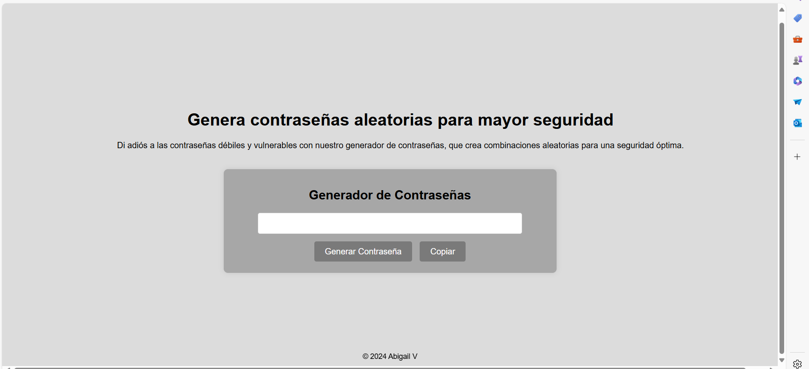

#  Página web generadora de contraseñas

Este es un generador de contraseñas aleatorias diseñado para mejorar la seguridad en tus cuentas y datos personales. La aplicación crea contraseñas seguras y aleatorias de 12 caracteres que incluyen letras mayúsculas y minúsculas, números y caracteres especiales. Además, ofrece la opción de copiar la contraseña generada al portapapeles con un solo clic.

# Características
Generación de Contraseñas: Crea contraseñas seguras con una longitud de 12 caracteres.
Copiar al Portapapeles: Permite copiar la contraseña generada fácilmente para que puedas pegarla en cualquier formulario o aplicación.
Interfaz Intuitiva: Diseñado para ser fácil de usar, con una interfaz simple y funcional.
# Tecnologías Utilizadas
HTML: Estructura del contenido.
CSS: Estilos y diseño.
JavaScript: Lógica para generar contraseñas y copiar al portapapeles.

# Mi sitio

Desarrollado por [Abigail](https://github.com/abvvt)
